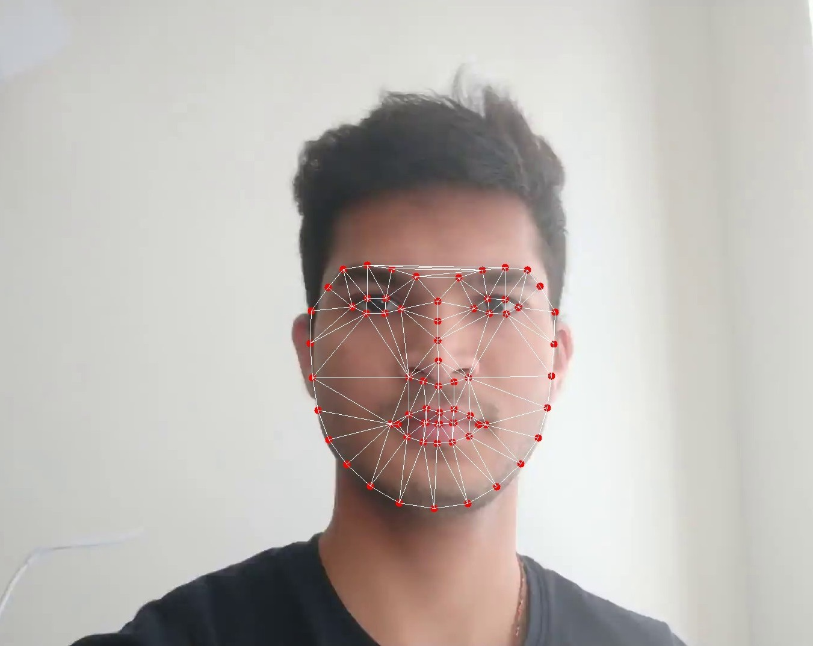
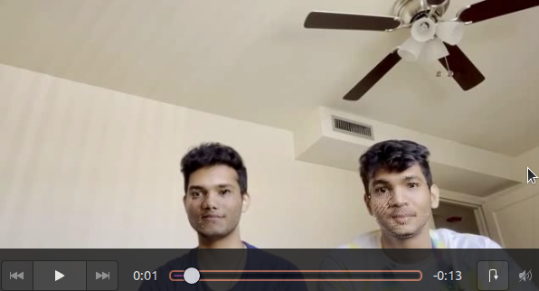
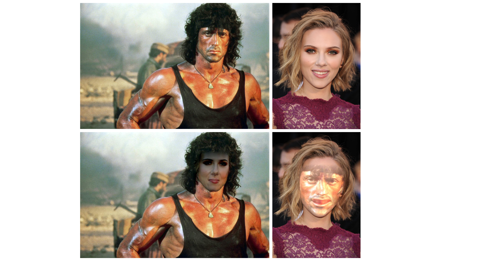

# FaceSwap

Digital face replacement is an interesting technology, that has been used in multiple entertainment media. In this project, 2 classical methods to warp faces been implemented:

1. Delauny Triangulation.
2. Thin Plate Spline.

## Implementation

The steps to implement face warping are as follows

### 1. Detecting Facial Landmarks

The traditional approach consist of 4 important steps which are detecting face fiducials, Warping to other face, replacing the face and then performing blending.The facial landmarks for both the target and source faces need to be found for one-to-one correspondance to reduce computational complexity. This is acheived using `dlib`.

 

### 2. Face warping

After we have facial landmarks, to warp faces we have 2 methods to acheive the warping:

#### 1. Delaunay Triangulation

To swap the faces we need to warp the faces in 3D, however we don’t have 3D information. So we make some assumption about the 2D image to approximate 3D information of the face by triangulation using the facial landmarks as corners and assuming that in each triangle the content is planar and hence the warping between the triangles in two images is affine. Delaunay Triangulation is used as it tries to maximize the smallest angle in each triangle. Since we use dlib to find the facial landmarks, there is correspondence between the facial landmarks and hence correspondence between the triangles.

Here are the target and source images with delaunay traingulations:

 

Post warping:

Similarly, for an image with 2 faces that need to be swapped:

 

#### 2. Thin Plate Spline

Face warping using triangulation assumes that we are doing affine transformation on eachtriangle. This might not be the best way to do warping sincethe human face has a very complex and smooth shape. A better way to do the transformation is by using Thin Plate Splines (TPS) which can model arbitrarily complex shapes. We compute a TPS that maps from the feature points in B to the corresponding feature points in A .

Thin Plate Spline Output:

Thin Plate Spline swap:

This concludes the classical method of implementation.

---

## Deep Learning Method

For the deep learning method, we use the PRNet Model.

The code was further modified to take the target and source faces from a single image:

